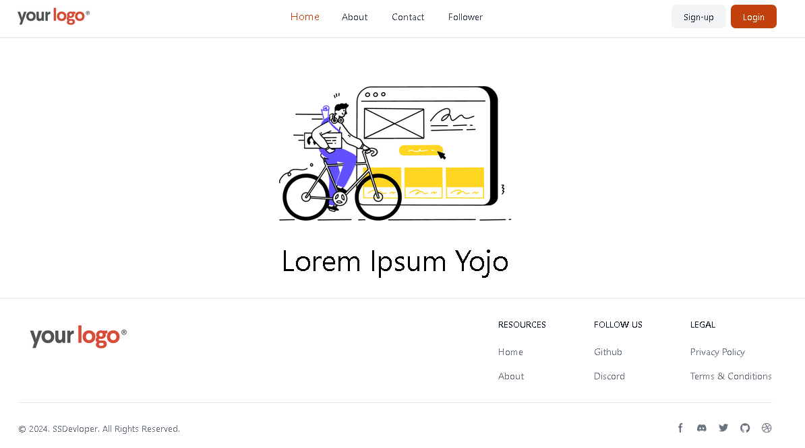
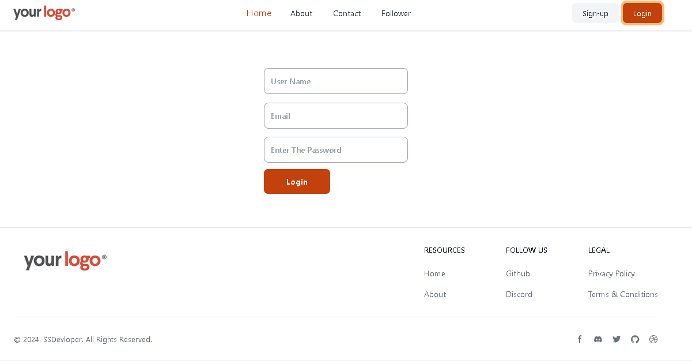
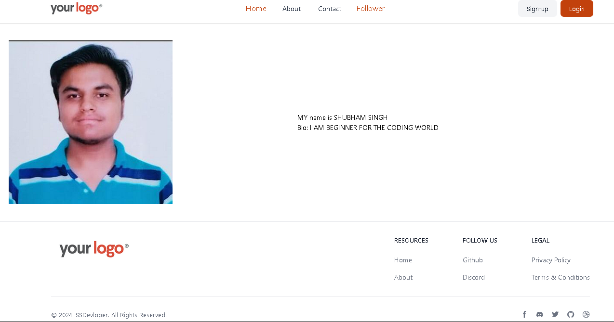

# Landing Page Template

A Simple Basic Landing Page Template  Built with  React.js/Tailwindcss that is basically a Landing Page Comes With Different Path Routes.

## Features

- Diffrent Routes Provide
- Using React Router Dom Package
- Responsive 
- Prebuild Login Signup Components

## Screenshots

###

###

###

## Getting Started

 Follow these instructions to get a copy of the project up and running on your local machine.

### Prerequisites

 - Node.js
 - React.js
 - That two Application Must Be Installed in your System Before Starting The Application

 ### Installing
 1. Clone the repository:

 git clone https://github.com/ssdevloper/Landing_Page.git

 ### Run Command

 cd Landing_Page
 
 npm Install

 npm run dev

- make sure your react router dom packege is install

### Author

Shubham Singh